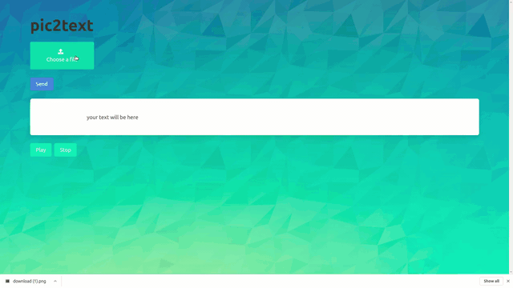

Сервис для получения электронного текста с изображения, а также озвучания данного текста.
Приложение может быть полезно для детей, учащихся читать, а также для людей со слабым зрением.

### Интерфейс:

Для использования необходимо загрузить картинку с локального хранилища и нажать кнопку "SEND".
Спустя некоторое время появится прочитанный с изображения текст, затем его можно озвучить нажав на кнопку "PLAY".

[Демонстрация со звуком](https://www.youtube.com/watch?v=HBwZX0W-y10).

Запуск программы:

> сервер - npm start

> клиент - npm serve
